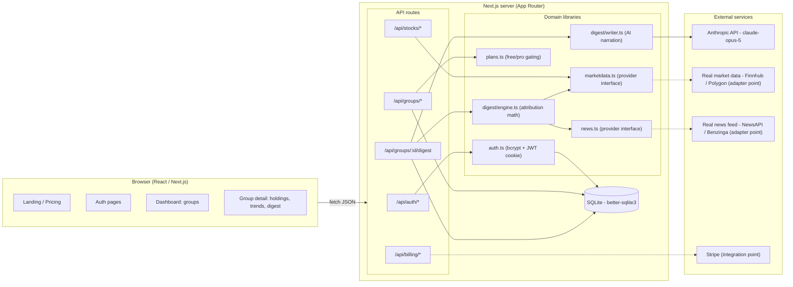
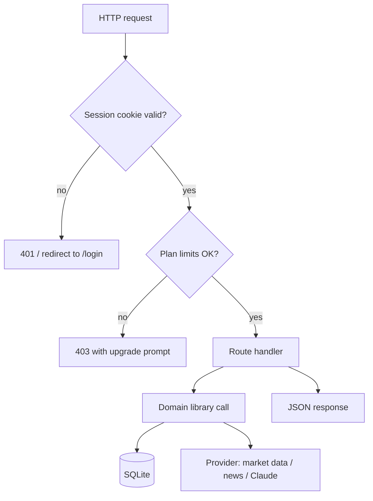
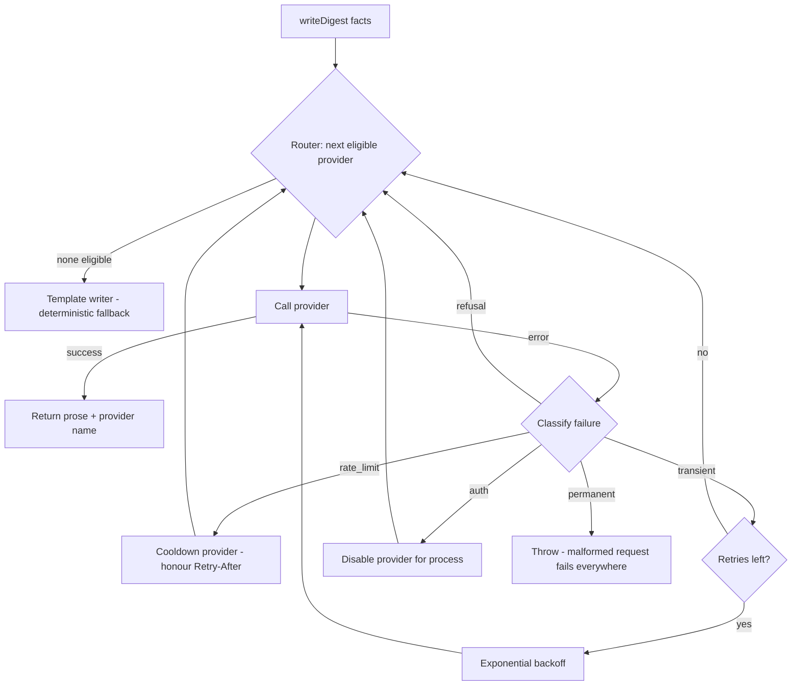

# Architecture

## System overview

## Tech flow: request lifecycle

## LLM provider failover

The digest writer never calls a provider SDK directly — it calls the router, which owns
priority order, error classification, cooldown state and retries.

Cooldown state is held on a process-wide router instance deliberately: knowing "Gemini is
rate limited until 14:32" is only useful if every request shares that knowledge. The
classifier reads HTTP status codes and message patterns rather than SDK-specific error
classes, so a provider SDK upgrade cannot silently break failover.

## Key design decisions

| Decision | Rationale |
|---|---|
| **Facts-first digest** — pure math in `engine.ts`, AI only narrates | The AI can never invent numbers; wrong-number risk and compliance risk drop sharply. |
| **No predictions by design** | System prompt + product copy forbid buy/sell advice and price predictions. This is the compliance moat (publisher exemption posture). |
| **Deterministic mock providers** | Whole app runs with zero API keys; tests are reproducible; real providers are drop-in adapters. |
| **Template writer fallback** | Digest generation never hard-fails: no key, API error, or safety refusal all degrade gracefully. |
| **SQLite first** | Zero-ops MVP. The `db.ts` repository layer isolates SQL, so Postgres is a contained swap when scale demands. |
| **Plan gating in one module** | `plans.ts` is the single source of truth for free/pro limits, enforced server-side in every route. |

## Scaling path (post-MVP)

1. SQLite → Postgres (swap `db.ts` internals; schema is portable).
2. On-demand digests → nightly batch job per user (queue + cron), delivered by email.
3. Mock providers → licensed market data + news APIs with caching layer (Redis).
4. Billing stub → Stripe Checkout + webhooks (`/api/billing` already marks the seam).
5. Add broker linking (Plaid/SnapTrade) so digests use real positions, not just watchlists.
