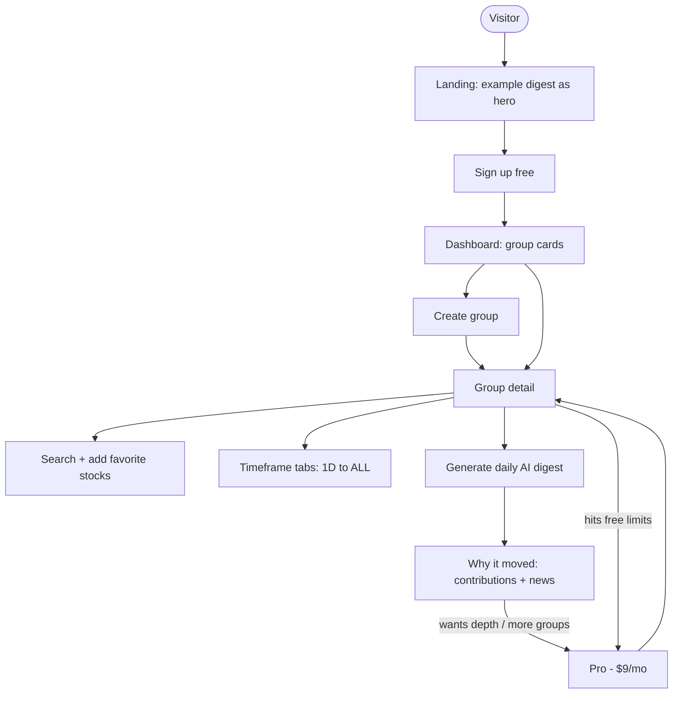
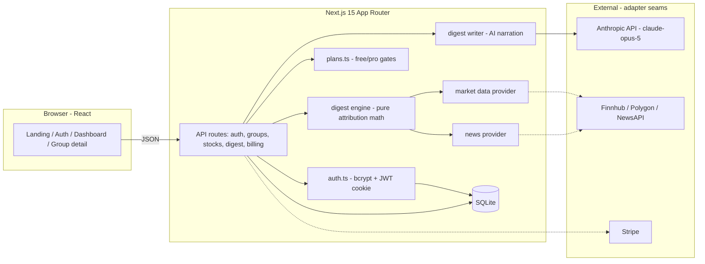
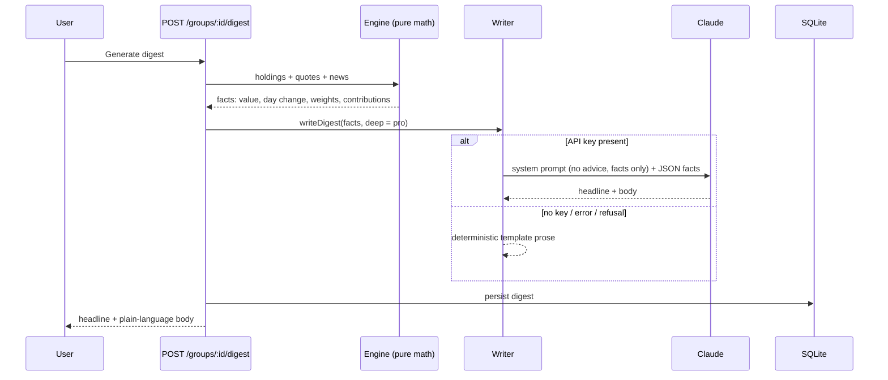

# TradeMyShow — Product Design Document

**Know exactly why your portfolio moved today.**

A freemium SaaS where users group their favorite stocks and get a daily, plain-language AI digest:
which holdings drove the move, by exactly how much, and which news was behind it. Analytics and
education by design — never predictions, never advice.

| Status | |
|---|---|
| MVP | Built, tested, pushed |
| Tests | 30 unit + API integration (vitest), 1 Playwright e2e journey — all passing |
| Stack | Next.js 15 · TypeScript · SQLite · Anthropic Claude |

---

## 1. Screen mockups

The product commits to a dark trading-desk interface. These describe the shipped UI.

### Landing page

The digest itself is the hero — the value proposition is shown, not described.

```
┌────────────────────────────────────────────────────────────┐
│  TradeMyShow                    Pricing   Log in  [Sign up]│
├────────────────────────────────────────────────────────────┤
│                                                            │
│        Know exactly WHY your portfolio moved today         │
│                                                            │
│    Group your favorite stocks — our AI explains every      │
│    move in plain language. Trends 1D to all-time.          │
│                                                            │
│           [ Create your free group ]  [ See plans ]        │
│                                                            │
│    ┌──────────────────────────────────────────────────┐    │
│    │ TODAY'S DIGEST — EXAMPLE                         │    │
│    │ "AI & Chips" is up +1.4% today, led by NVDA      │    │
│    │ NVIDIA rose +3.2%, contributing +1.1% of the     │    │
│    │ move — likely driver: earnings beat…             │    │
│    └──────────────────────────────────────────────────┘    │
└────────────────────────────────────────────────────────────┘
```

### Dashboard

Group cards lead with value and day change — this is the daily habit loop.

```
┌────────────────────────────────────────────────────────────┐
│  Your groups                                     [Create]  │
├────────────────────────────────────────────────────────────┤
│  ┌─────────────────────┐  ┌─────────────────────┐          │
│  │ AI & Chips          │  │ Dividend Core       │          │
│  │ $1,284              │  │ $4,970              │          │
│  │ +1.42% today        │  │ −0.31% today        │          │
│  │ · 3 stocks          │  │ · 5 stocks · Pro    │          │
│  └─────────────────────┘  └─────────────────────┘          │
└────────────────────────────────────────────────────────────┘
```

### Group detail — the core screen

Digest on top, then per-holding attribution: today's move, the selected timeframe's trend,
portfolio weight, and each stock's exact contribution to the group's change.

```
┌──────────────────────────────────────────────────────────────────────────┐
│  DAILY AI DIGEST                                    [Refresh digest]     │
│  Your "AI & Chips" group gained +1.42% today, led by NVDA                │
│  NVIDIA (NVDA) rose +3.21%, contributing +1.08% of the group's move      │
│  (33.9% of the portfolio). Likely driver: NVIDIA tops quarterly          │
│  earnings estimates, raises full-year guidance (MarketWire). TSM fell    │
│  −0.84%, costing −0.22%…          Not investment advice.                 │
├──────────────────────────────────────────────────────────────────────────┤
│  HOLDINGS & TRENDS      1D  1W [1M] 3M  6M  1Y  5Y  YTD  ALL             │
│  ┌──────┬─────────┬────────┬──────────┬───────┬────────┬──────────────┐  │
│  │Stock │ Price   │ Today  │ 1M trend │ 1M %  │ Weight │ Contribution │  │
│  ├──────┼─────────┼────────┼──────────┼───────┼────────┼──────────────┤  │
│  │ NVDA │ $435.10 │ +3.21% │  ╱╱▔     │ +8.4% │ 33.9%  │   +1.08%     │  │
│  │ AMD  │ $162.44 │ +1.02% │  ╱─╱     │ +3.1% │ 37.9%  │   +0.39%     │  │
│  │ TSM  │ $121.02 │ −0.84% │  ▔╲╲     │ −2.2% │ 28.2%  │   −0.22%     │  │
│  └──────┴─────────┴────────┴──────────┴───────┴────────┴──────────────┘  │
└──────────────────────────────────────────────────────────────────────────┘
```

---

## 2. User flow — visitor to paying subscriber



---

## 3. Architecture



---

## 4. Tech flow — the digest pipeline

The one deliberate constraint that defines the product: **math first, AI second.** The engine
computes every number; Claude only narrates the computed facts — so the digest can never invent a
figure, never predicts, and never advises.



---

## 5. Build status

| Layer | Shipped in MVP |
|---|---|
| Auth | Email/password, bcrypt, JWT httpOnly session, guarded routes |
| Groups | CRUD, favorites per group, server-side free/pro limits |
| Analytics | 9 timeframes (1D–ALL), sparklines, weight & contribution attribution |
| AI digest | Claude writer + deterministic fallback; refusal-safe; per-plan depth |
| Data | Deterministic mock market/news providers behind real-provider seams |
| Billing | Plan gating live; upgrade stub with documented Stripe seam |
| Testing | 30 vitest unit + API integration tests · Playwright e2e journey |

### Next steps (integration work, not restructuring)

1. **Real data feeds** — licensed market data + news APIs behind the existing provider interfaces, with caching.
2. **Scheduled digests** — nightly batch per user, delivered by email (the habit loop).
3. **Stripe billing** — Checkout + webhooks replacing the stub.
4. **Broker linking** — Plaid/SnapTrade so digests explain real positions, not just watchlists.
5. **Postgres + hosting** — swap the contained SQLite layer when scale demands.

---

See also [ARCHITECTURE.md](ARCHITECTURE.md) for deeper system detail and
[FLOWS.md](FLOWS.md) for the full flow diagrams.
