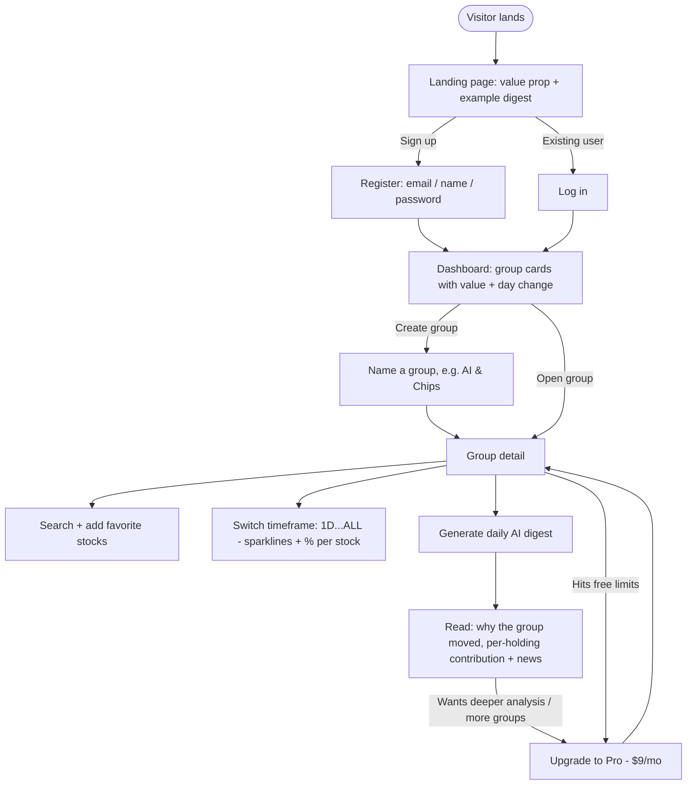
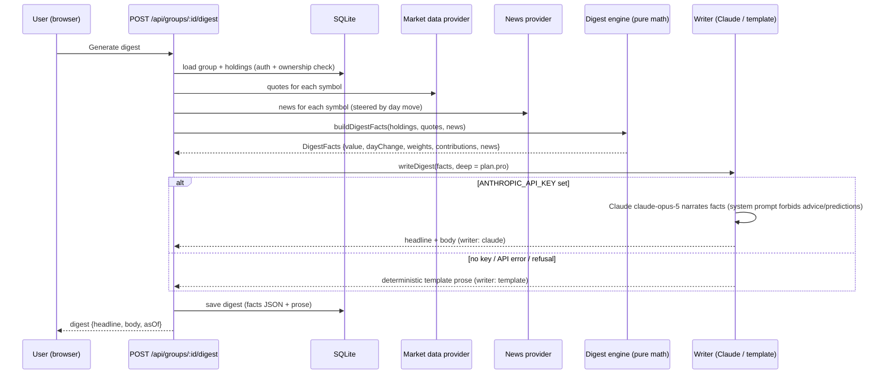
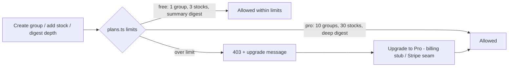

# User & Data Flows

## User flow

```mermaid
flowchart TD
    Start([Visitor lands]) --> Landing[Landing page: value prop + example digest]
    Landing -->|Sign up| Register[Register: email / name / password]
    Landing -->|Existing user| Login[Log in]
    Register --> Dash
    Login --> Dash[Dashboard: group cards with value + day change]
    Dash -->|Create group| NewGroup[Name a group, e.g. AI & Chips]
    NewGroup --> Group
    Dash -->|Open group| Group[Group detail]
    Group --> AddStock[Search + add favorite stocks]
    Group --> Trends[Switch timeframe: 1D...ALL - sparklines + % per stock]
    Group --> GenDigest[Generate daily AI digest]
    GenDigest --> ReadDigest[Read: why the group moved, per-holding contribution + news]
    ReadDigest -->|Wants deeper analysis / more groups| Upgrade[Upgrade to Pro - $9/mo]
    Upgrade --> Group
    Group -->|Hits free limits| Upgrade
```

## Digest generation pipeline

```mermaid
sequenceDiagram
    participant U as User (browser)
    participant API as POST /api/groups/:id/digest
    participant DB as SQLite
    participant MD as Market data provider
    participant NW as News provider
    participant EN as Digest engine (pure math)
    participant WR as Writer (Claude / template)

    U->>API: Generate digest
    API->>DB: load group + holdings (auth + ownership check)
    API->>MD: quotes for each symbol
    API->>NW: news for each symbol (steered by day move)
    API->>EN: buildDigestFacts(holdings, quotes, news)
    EN-->>API: DigestFacts {value, dayChange, weights, contributions, news}
    API->>WR: writeDigest(facts, deep = plan.pro)
    alt ANTHROPIC_API_KEY set
        WR->>WR: Claude claude-opus-5 narrates facts (system prompt forbids advice/predictions)
        WR-->>API: headline + body (writer: claude)
    else no key / API error / refusal
        WR-->>API: deterministic template prose (writer: template)
    end
    API->>DB: save digest (facts JSON + prose)
    API-->>U: digest {headline, body, asOf}
```

## Plan gating

```mermaid
flowchart LR
    Req[Create group / add stock / digest depth] --> Limits{plans.ts limits}
    Limits -->|free: 1 group, 3 stocks, summary digest| FreePath[Allowed within limits]
    Limits -->|over limit| Deny[403 + upgrade message]
    Limits -->|pro: 10 groups, 30 stocks, deep digest| ProPath[Allowed]
    Deny --> UpgradeBtn[Upgrade to Pro - billing stub / Stripe seam]
    UpgradeBtn --> ProPath
```
